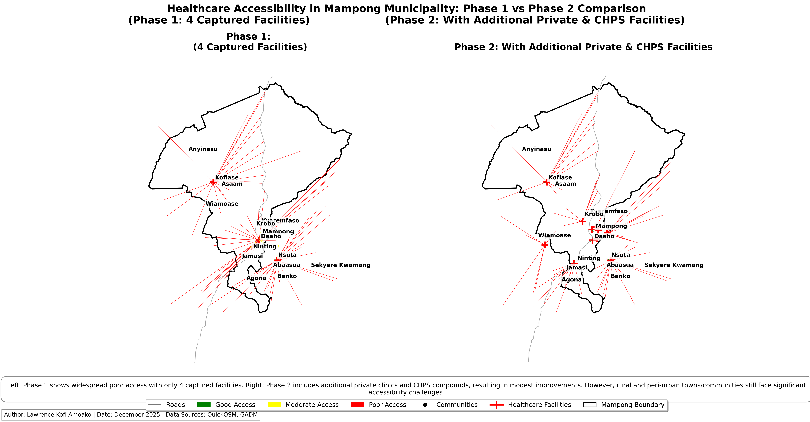

# Healthcare Accessibility Analysis in Mampong Municipality, Ghana

**Lawrence Kofi Amoako** | December 2025

## Project Overview
This GIS project assesses spatial accessibility to healthcare facilities in Mampong Municipality, Ashanti Region, Ghana using QGIS and Python.

- **Phase 1**: Analysis based on Health facilities from OpenStreetMap.
- **Phase 2**: Enriched with manually digitized private clinics and CHPS compounds.
- **Key Finding**: Private and CHPS facilities provide modest improvements, but rural areas remain underserved.

## Key Outputs
- Static thematic maps (Phase 1, Phase 2, side-by-side comparison)
- Professional report with policy recommendations

## Folder Structure
- `/data` — Geospatial datasets
- `/maps` — Exported maps (PNG & PDF)
- `/scripts` — Python scripts for map generation
- `/report` — Final report (DOCX/PDF)
- `/qgis_project` — QGIS project file (.qgz)

## Tools Used
- QGIS 3.34
- Python (geopandas, matplotlib)
- Data sources: OpenStreetMap, GADM, manual digitization

## How to Explore
1. Open `/qgis_project/healthcare_accessbility_mampong_Phase2.qgz` in QGIS.
2. Run Python scripts in `/scripts` to regenerate maps.

## Preview

## License
MIT License — free to use and adapt.

---
*Project completed as part of GIS studies.*